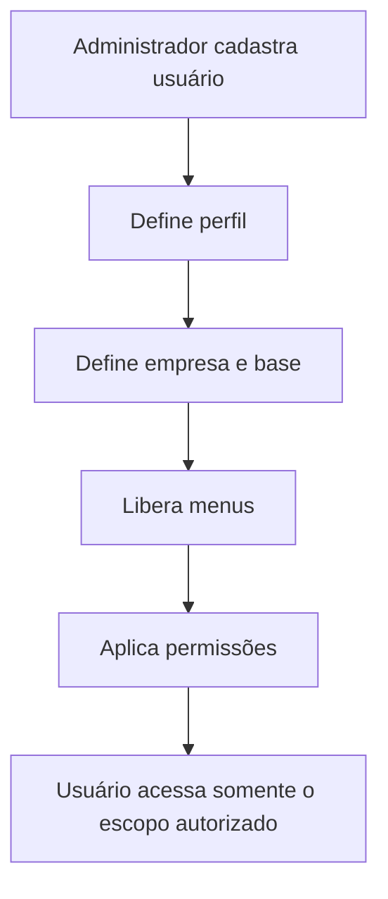

# Administração e Acessos

## Objetivo

Controlar empresas, usuários, perfis, menus e permissões dentro de uma estrutura multiempresa.

## Principais recursos

### Empresas

O SGR Web foi pensado para atender múltiplas empresas em uma única plataforma.

Cada empresa pode possuir:

- usuários;
- bases;
- motoristas;
- configurações;
- rotas;
- documentos;
- movimentações;
- relatórios próprios.

### Usuários

Permite cadastrar e administrar usuários internos e externos.

### Perfis

Perfis representam grupos de responsabilidade, como:

- administrador;
- supervisor;
- gerente;
- financeiro;
- motorista;
- cadastro;
- gestor.

### Permissões

As permissões limitam o acesso a funcionalidades e informações.

O princípio esperado é:

> cada usuário deve visualizar somente os recursos necessários à sua função.

### Menus dinâmicos

O sistema possui controle de menus por perfil, permitindo habilitar ou ocultar funcionalidades conforme a autorização.

### Empresas liberadas

Usuários podem ser vinculados apenas às empresas às quais possuem acesso.

### Bases autorizadas

Quando aplicável, o acesso também pode ser limitado por base operacional.

### Configuração do Portal do Motorista

A administração define parâmetros que impactam o portal, como:

- recursos disponíveis;
- períodos para alteração de disponibilidade;
- regras de check-in;
- mensagens operacionais;
- permissões de consulta.

## Fluxo resumido

## Regras principais identificadas

- motorista acessa somente o Portal do Motorista;
- usuários internos acessam apenas menus autorizados;
- dados devem respeitar o isolamento entre empresas;
- ações críticas devem ser registradas;
- permissões devem ser aplicadas tanto na interface quanto no backend.

## Pontos ainda a validar

- matriz completa de permissões;
- herança entre perfis;
- possibilidade de múltiplos perfis por usuário;
- regras de acesso por base;
- comportamento de usuários inativos;
- política de senha e recuperação de acesso.
