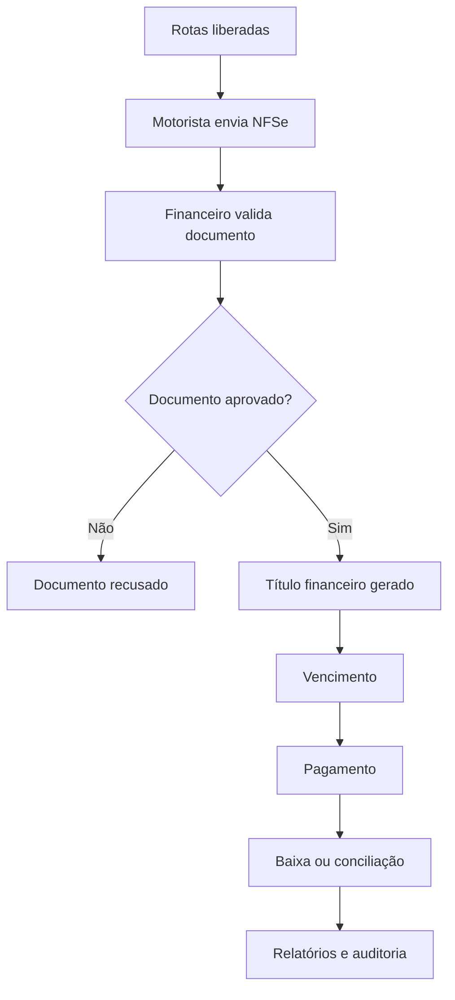

# Gestão Financeira

## Objetivo

Centralizar os processos financeiros relacionados à operação, documentos fiscais, títulos, pagamentos e movimentações de caixa.

## Perfis envolvidos

- financeiro;
- administrador;
- gestor;
- motorista ou prestador, em consultas específicas;
- ajudante, quando aplicável.

## Principais recursos

### Dashboard financeiro

Apresenta uma visão consolidada da situação financeira da empresa.

Pode incluir indicadores relacionados a:

- contas a pagar;
- contas a receber;
- vencidos;
- baixados;
- estornados;
- pendentes;
- movimentações recentes.

### Recebimento e validação de NFSe

O financeiro analisa os documentos enviados pelos motoristas.

A validação considera:

- empresa titular;
- prestador emitente;
- valor total;
- rotas liberadas;
- duplicidade;
- integridade do documento.

### Geração automática de títulos

Após a aprovação da NFSe, o sistema pode gerar automaticamente um título financeiro para o titular do documento, com vencimento previamente definido.

### Títulos financeiros

Permite acompanhar:

- contas a pagar;
- contas a receber;
- vencimentos;
- baixas;
- estornos;
- situações pendentes.

### Movimentação de caixa

Registra entradas e saídas relacionadas à operação.

### Conta caixa

Permite organizar contas ou caixas financeiros utilizados pela empresa.

### Conciliação

A conciliação busca conferir se títulos, pagamentos e movimentações correspondem ao que foi efetivamente realizado.

O módulo está descrito como funcional, porém ainda em evolução.

### Pagamentos de ajudantes

O sistema também contempla controle de pagamentos vinculados a ajudantes.

### Faturamento XML

Há suporte a leitura e processamento de XML de NFS-e/DANFSe por parser próprio.

### Auditoria financeira

Mantém rastreabilidade sobre operações financeiras relevantes.

## Fluxo resumido

## Regras principais identificadas

- a soma das rotas liberadas deve corresponder ao valor da nota;
- a empresa emissora deve ser compatível com a operação;
- documentos duplicados devem ser bloqueados ou sinalizados;
- a aprovação da nota pode gerar título automaticamente;
- rotas divergentes não devem seguir normalmente para faturamento;
- pagamentos e estornos devem possuir histórico.

## Pontos ainda a validar

- fórmula exata de vencimento;
- estados completos dos títulos;
- regras de baixa;
- níveis de aprovação;
- critérios de conciliação;
- tratamento de estornos;
- integração entre título, caixa e documento.
