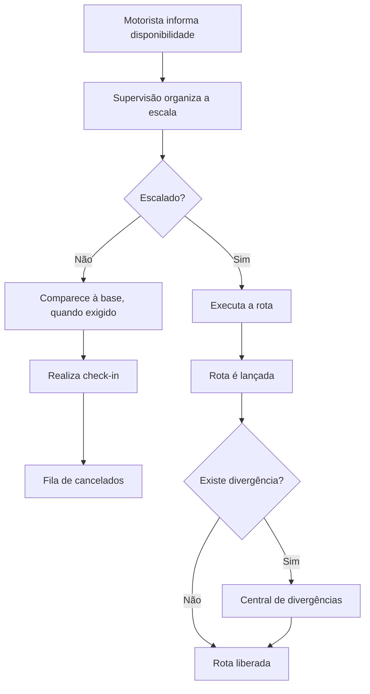

# Operação Logística

## Objetivo

Centralizar a operação diária das transportadoras, desde a disponibilidade dos motoristas até o lançamento, acompanhamento e liberação das rotas.

## Perfis envolvidos

- administrador;
- supervisor;
- gerente operacional;
- equipe de cadastro;
- motorista ou prestador de serviço;
- ajudante, quando aplicável.

## Principais recursos

### Bases operacionais

Permite cadastrar e administrar os locais de operação e carregamento de cada empresa.

As bases podem ser utilizadas em fluxos como:

- escala;
- check-in;
- lançamento de rotas;
- fila de cancelados;
- relatórios;
- auditoria de presença.

### Escala de motoristas

A escala organiza a disponibilidade dos prestadores por período.

O fluxo atual considera:

1. o motorista informa ou altera sua disponibilidade;
2. a empresa organiza os motoristas escalados;
3. motoristas podem ser classificados como escalados ou cancelados;
4. cancelados podem precisar comparecer à base para oportunidades de segundo ciclo;
5. a equipe acompanha a escala diária ou semanal.

### Disponibilidade

O próprio prestador pode atualizar sua disponibilidade dentro do período permitido pela empresa.

Benefícios:

- redução de formulários paralelos;
- menos retrabalho da supervisão;
- maior autonomia do motorista;
- registro centralizado das alterações.

### Lançamento de rotas

A empresa registra as rotas realizadas e as vincula aos respectivos motoristas.

O lançamento pode incluir informações como:

- data;
- tipo de rota;
- duração;
- valor;
- motorista;
- empresa;
- base operacional;
- situação da rota.

### Visualização de rotas

Permite acompanhar as rotas já lançadas, seus valores e respectivas situações.

O motorista também pode consultar suas rotas pelo portal.

### Divergências de rota

O motorista pode sinalizar uma divergência quando:

- o valor estiver incorreto;
- o tipo de rota não corresponder ao realizado;
- houver ausência de uma rota;
- existir outra inconsistência operacional.

A divergência deve ser analisada antes da continuidade do fluxo financeiro.

### Check-in na base

O projeto contempla comprovação de presença por meio de:

- localização dentro do raio da base;
- selfie;
- leitura de QR Code disponível no local.

O check-in é especialmente relevante para prestadores cancelados que precisam comparecer presencialmente.

### Fila de cancelados

Organiza os prestadores que compareceram à base após cancelamento ou ausência de rota inicial.

O objetivo é reduzir controles em papel, listas informais e perda de posição.

### Score do motorista

O score apoia a análise de desempenho com base em indicadores como:

- disponibilidade;
- frequência de escalas;
- presença;
- faltas;
- participação na operação.

O cálculo exato e os pesos utilizados devem ser documentados em uma etapa posterior.

### Central de pendências

Reúne situações que exigem ação da equipe operacional, evitando que problemas fiquem dispersos em planilhas ou mensagens.

### Ajudantes

O sistema também contempla lançamento e acompanhamento de ajudantes vinculados à operação.

## Fluxo resumido

## Pontos ainda a validar

- regra exata de ordenação da fila de cancelados;
- fórmula completa do score;
- critérios obrigatórios de check-in por empresa;
- estados possíveis de uma rota;
- permissões específicas por perfil;
- relação entre cancelamento, check-in e segundo ciclo.
