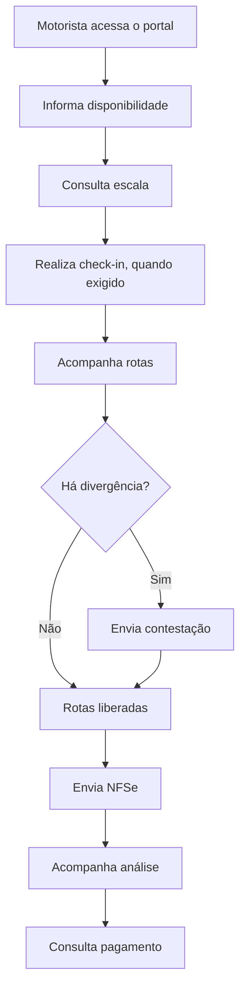

# Portal do Motorista

## Objetivo

Oferecer ao motorista ou prestador de serviço um ambiente próprio para acompanhar sua operação sem depender continuamente da equipe administrativa.

## Principais recursos

### Acesso restrito

O motorista acessa somente o portal destinado ao seu perfil.

### Disponibilidade

Permite:

- informar disponibilidade;
- alterar disponibilidade;
- registrar ausência;
- acompanhar o período válido para mudanças.

### Escalas

O prestador pode consultar:

- dias e horários escalados;
- situação da escala;
- cancelamentos;
- orientações da operação.

### Check-in

Quando exigido, o motorista pode realizar check-in utilizando:

- localização;
- selfie;
- QR Code.

### Rotas realizadas

O portal apresenta as rotas vinculadas ao prestador, incluindo informações operacionais e financeiras disponíveis para consulta.

### Divergências

O motorista pode contestar rotas ou valores divergentes.

A contestação deve ser analisada antes da liberação definitiva da rota para faturamento.

### Envio de NFSe

Após o fechamento do ciclo e liberação das rotas, o motorista pode enviar a nota fiscal de serviço.

O sistema deve confrontar:

- empresa emitente;
- valor total da nota;
- rotas liberadas;
- eventual duplicidade;
- informações obrigatórias.

### Documentos

O motorista pode acompanhar os documentos enviados e sua situação, como:

- pendente;
- aprovado;
- recusado;
- pago, quando aplicável.

### Pagamentos

O portal permite consultar pagamentos confirmados e demais informações financeiras liberadas ao prestador.

## Fluxo resumido

## Benefícios

- autonomia do prestador;
- maior transparência;
- redução de mensagens e formulários paralelos;
- histórico centralizado;
- menor dependência de atendimento presencial;
- acompanhamento do fluxo financeiro.

## Pontos ainda a validar

- estados exatos de documentos;
- prazo de alteração de disponibilidade;
- mensagens exibidas em cada etapa;
- permissões do motorista em relação a dados financeiros;
- regras de bloqueio para documentos duplicados.
