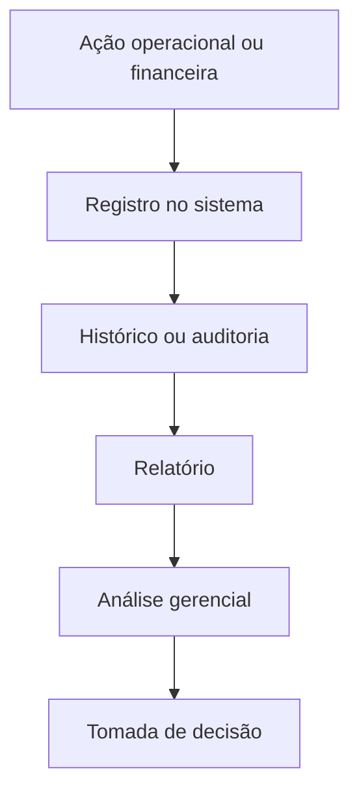

# Relatórios e Auditorias

## Objetivo

Oferecer visão consolidada da operação e manter rastreabilidade sobre ações relevantes.

## Relatórios identificados

### Central gerencial

Centraliza indicadores e informações das áreas:

- operação;
- financeiro;
- motoristas;
- documentos;
- auditorias.

### Relatórios operacionais

Podem apoiar o acompanhamento de:

- escalas;
- rotas;
- cancelamentos;
- check-ins;
- divergências;
- score;
- motoristas;
- bases.

### Relatórios financeiros

Apresentam informações como:

- contas a pagar;
- contas a receber;
- vencidos;
- baixados;
- estornados;
- pagamentos;
- movimentações.

### Documentos e arquivos

Permitem acompanhar arquivos enviados pelo sistema, especialmente notas fiscais e documentos relacionados à operação.

## Auditorias identificadas

- auditoria financeira;
- auditoria de supervisor;
- auditoria de check-in;
- histórico de pagamentos;
- histórico de estornos;
- mapa de check-ins;
- registros gerais do sistema.

## Benefícios

- rastreabilidade;
- apoio à tomada de decisão;
- identificação de inconsistências;
- comprovação de ações;
- redução de conflitos operacionais;
- acompanhamento da evolução da empresa.

## Fluxo resumido

## Pontos ainda a validar

- filtros disponíveis em cada relatório;
- formatos de exportação;
- período de retenção dos registros;
- usuários autorizados;
- nível de detalhamento das auditorias;
- dados que podem ser anonimizados.
